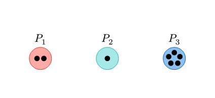
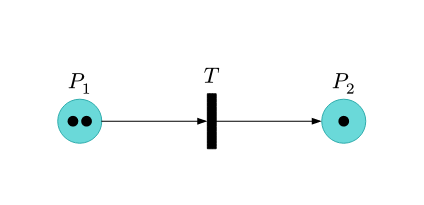
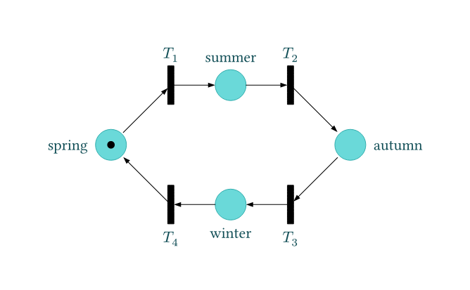
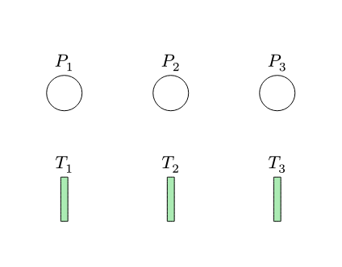
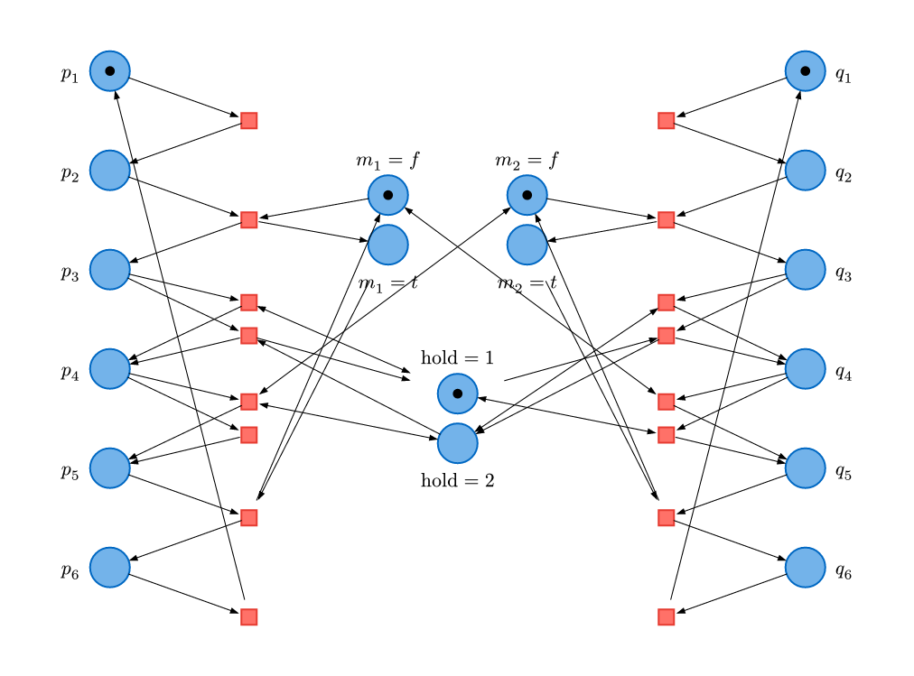
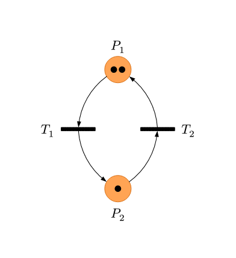
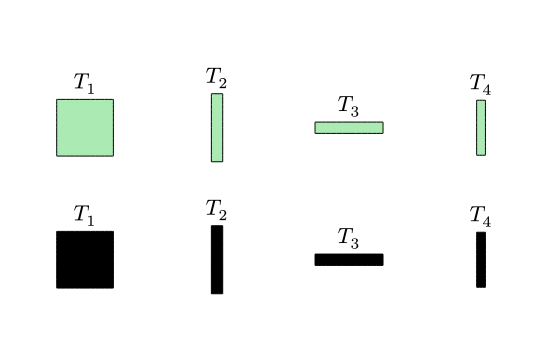
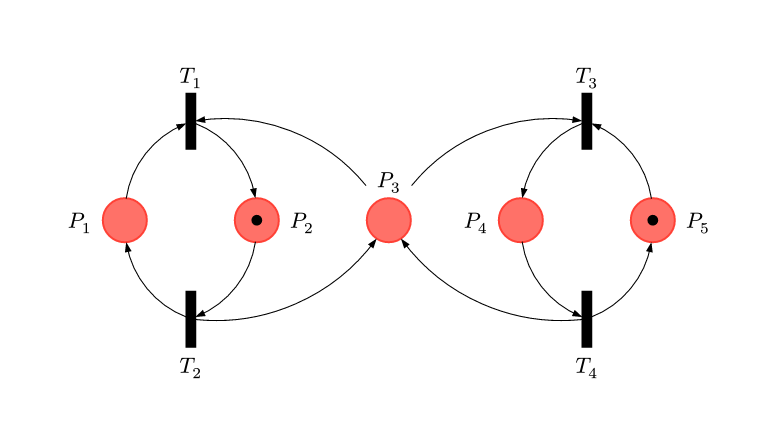
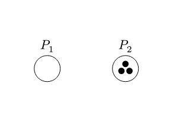

# Tests

Tests of the library, which can be hacked on using `typst-test`.

Many of the tests are inspired by prior work in TikZ, including:
- <https://latexdraw.com/petri-nets-tikz/>
- <https://tikz.dev/library-petri>

## Example gallery

The following examples are obtained by rendering the individual tests.

